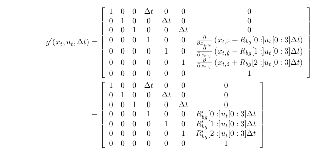
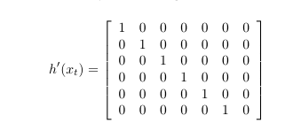
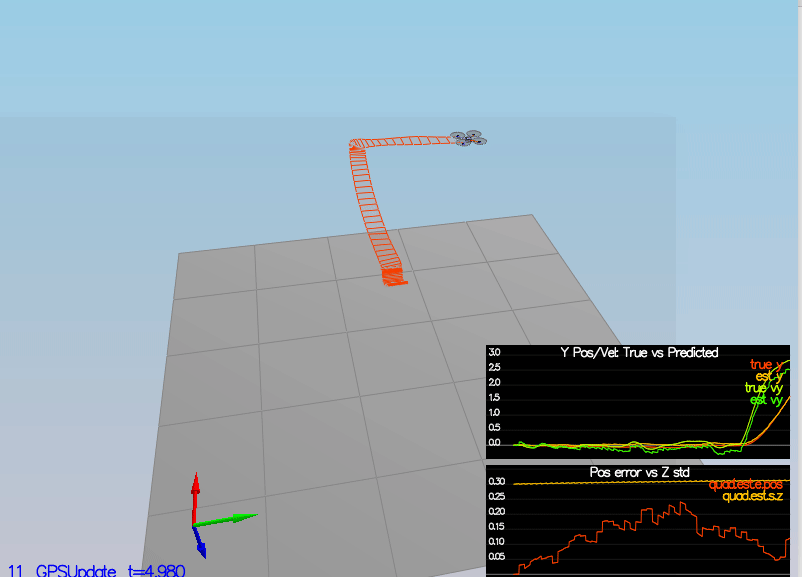

# Estimation Project #

In this project, we will be developing the estimation portion of the controller used in the CPP simulator.  By the end of the project, the simulated quad will be flying with the estimator and the custom controller (from the previous project)!


## Estimator implementation ##

The target state we aim to estimate/track for a 3D Quadrotor are as follows:

[x,y,z,x_dot, y_dot,z_dot, roll,pitch,yaw,p,q,r]

And the overall estimation architecture we used is as below,


### GPS X data and Accelerometer X data noise  ###

Based on some sensor data record on a static quad, we are able to calculate the standard deviation of the quad's sensors.

See [here](https://en.wikipedia.org/wiki/Standard_deviation) for more details on how std can be calcuated.

For example, in this project, the GPS X data and Accelerometer X data's standard deviation are as below,

```
MeasuredStdDev_GPSPosXY = 0.7
MeasuredStdDev_AccelXY = .5
```

The calculated standard deviation correctly capture ~68% of the sensor measurements. 
###   Attitude update based on IMU  ###

roll and pitch state are obtained by a complementary filter, which use measurment data from both gyroscopes and accelerometers.


In particular, the p,q from gyroscopes are in body frame, we need to use rotation matrix to transfrom them roll_dot, and pitch_dot into world frame.

The integration scheme for obtaining roll and pitch is done by using quaternions.


### EKF prediction step ###  

The prediction step predicts the current state and covariance forward by dt using the current accelerations and body rates as input.

we will first need to figure out the state transition function 

   


and its jocobian, 



and fill them in the classic the classic EKF prediction equation.


 


### EkF magnetometer update  ###

Magnetometer measurement can be used to update yaw state.

The measurement function h is sate itslef, and so its jocabian h_prime is as simple as [0,0,0,0,0,0,1]

### EkF GPS update ###

GPS data measurment can be used to update [x,y,z,x_dot,y_dot,z_dot].

The measurement model h is,  

   
and its jocabian h_prime is,  
   


## Flight Evaluation ##


### performance criteria ###

The estimator's parameters are properly adjusted to satisfy each of the performance criteria elements.

### De-tune previous controller ###

After completing the estimator, I replaced provided controller codes by those I wrote in last project, and re-tune relevant controller parameters, and successfully meet the performance criteria of the final scenarion.  

<p align="center">

</p>


